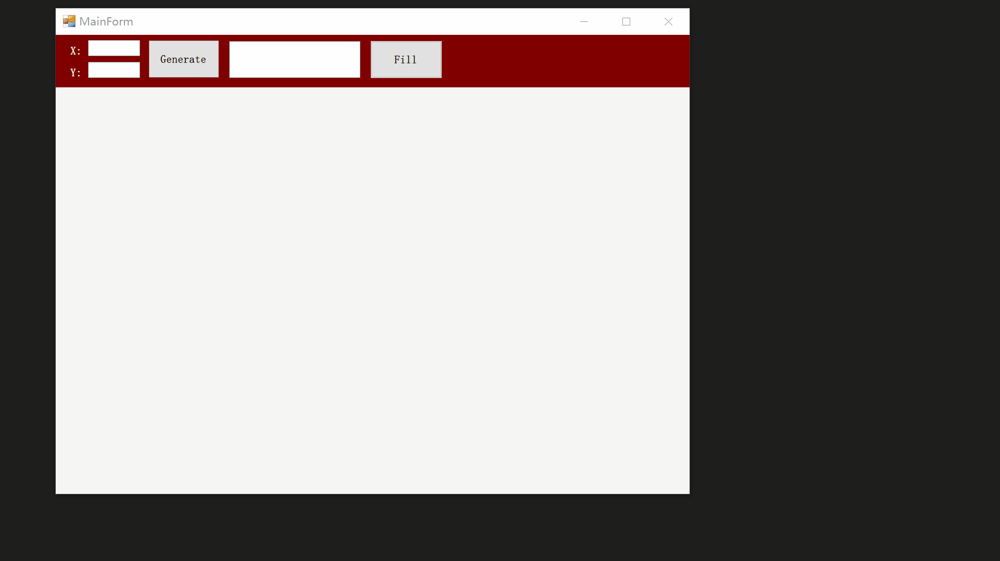

# DrawMapping
使用Rectangle绘制的一个Mapping控件(Winform).



## 代码示例
```csharp
Mapping mapping = new Mapping();
mapping.Dock = DockStyle.Fill;
mapping.StartDirection = StartDirection.LeftBottom;
panel.Controls.Add(mapping);
mapping.InitializeMapping(10, 10);
mapping.Focus(1, 1);
mapping.Fill(1, 1, "test item");
```

## 可在Visual Studio属性窗口中设置的项目
1. InitializedColor: 初始化Rectangle外边框的颜色；
2. FocusedColor: 聚焦的Rectangle的颜色;
3. FilledColor: 填充的Rectangle的颜色;
4. HorizontalSpace: 每两个Rectangle在水平方向的间距;
5. VerticalSpace: 每两个Rectangle在垂直方向的间距;
6. BorderWidth: 绘制Rectangle的边框宽度;
7. StartDirection: 设置坐标原点位置，支持：LeftBottom(左下)、RightBottom(右下)、LeftTop(左上)、RightTop(右上)四个角。