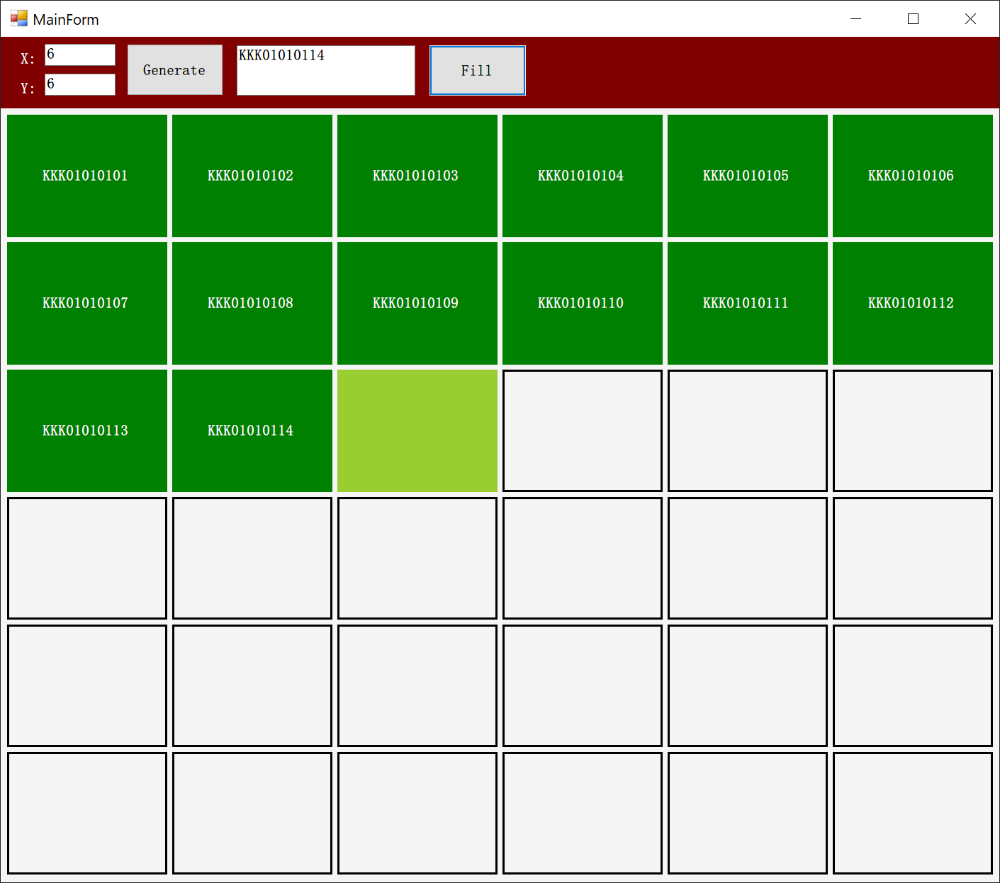

# DrawMapping
使用Rectangle绘制的一个Mapping控件(Winform).
```csharp
Mapping mapping = new Mapping();
mapping.Dock = DockStyle.Fill;
panel.Controls.Add(mapping);
mapping.InitializeMapping(10, 10);
mapping.FocusRect(1, 1);
mapping.FillRect(1, 1, "test item");
```
